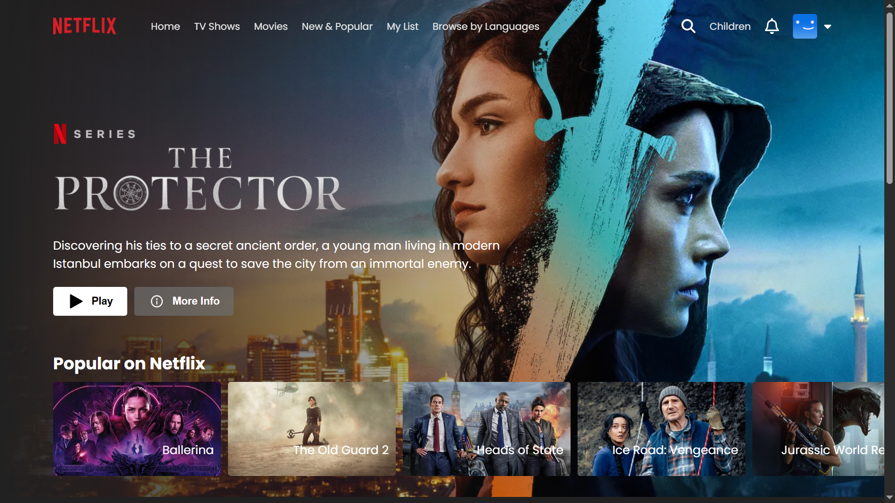

# 🎬 Netflix Clone

A full-featured, responsive **Netflix Clone** built using **React**, **Firebase Authentication**, **React Router DOM**, and a **custom Node.js API proxy** for TMDB movie data. This project replicates Netflix's core UI and functionality — including horizontal scroll cards, category-wise movie browsing, and YouTube trailer previews.

---

## 🔗 Live Link

👉 [Click here to view the live site](https://your-netflix-clone.vercel.app/)  

## 🎥 Demo Video

📽️ [Watch demo](https://drive.google.com/file/d/1-hjwmVvhRgAbZGMylffZv4N7OuNF7zRr/view?usp=drive_link)  

---

## 📸 Screenshots

### 🏠 Homepage (with title cards)

### 📺 Trailer Player Page

### 🔐 Login Page

---

## 🚀 Features

- ✅ Browse movies by categories (Now Playing, Top Rated, etc.)
- ✅ Horizontal scrolling cards like Netflix UI
- ✅ Click on a card to watch the trailer (YouTube embed)
- ✅ Firebase Email/Password Authentication
- ✅ Protected Player route (only accessible after login)
- ✅ React Toast Notifications
- ✅ Fully Responsive UI

---

## 🛠️ Tech Stack

| Technology         | Use Case                            |
|--------------------|-------------------------------------|
| React 19           | UI Components and State Management  |
| Vite               | Frontend Build Tool                 |
| Firebase Auth      | Sign In / Sign Out                  |
| React Router DOM   | Page Routing                        |
| React Toastify     | Alerts and Notifications            |
| TMDB API           | Movie & Trailer Data Source         |
| YouTube            | Trailer Embeds                      |
| Vercel             | Hosting (Frontend + API Proxy)      |

---

## 🔗 API & Proxy

### 🔍 Movie Data & Trailer API

- All data is fetched from **TMDB** (The Movie Database)
- To avoid CORS issues, this app uses a **Node.js proxy hosted on Vercel**

#### 🧪 Example API Endpoints

> Base URL: [`https://proxy-tmdb-chi.vercel.app`](https://proxy-tmdb-chi.vercel.app)

| Purpose                 | Full Endpoint URL                                                                 |
|-------------------------|-----------------------------------------------------------------------------------|
| Get movies by category  | `https://proxy-tmdb-chi.vercel.app/api/movies?type=now_playing`                  |
| Get trailer by movie ID | `https://proxy-tmdb-chi.vercel.app/api/trailer?id=846422`                        |

- Replace `now_playing` with `top_rated`, `popular`, `upcoming`, etc.
- Replace the `id` with any valid TMDB movie ID to fetch trailer info.

---

### ⚠️ Disclaimer

This project is a personal educational clone of the Netflix platform.
It is built purely for learning purposes using React, Firebase, and TMDB API.
This project is not affiliated with, endorsed by, or connected to Netflix or TMDB in any way.
All movie and trailer data is sourced from publicly available APIs, and trailers are embedded via YouTube.